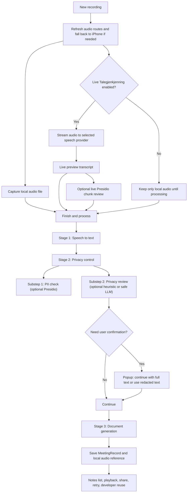

# skrivDet iOS App

skrivDet is an iPhone app for turning spoken recordings into structured notes. It started as a meeting transcription app, but the current product direction is broader: meetings, dictation, interviews, incident notes, conversation logs, workshop summaries, and other spoken records all fit the same flow.

This README is intended to describe how the app actually works now, not how it worked earlier in the prototype.

## Current State

skrivDet currently ships these main behaviors:

- A single native iOS launch screen with the centered skrivDet logo asset and Kvasetech credit.
- A three-tab SwiftUI app: Notes, Templates, Settings.
- A built-in 7-day local trial, plus personal and enterprise license activation against the skrivDet backend.
- Enterprise activation that can fetch and enforce centrally managed provider, privacy, template-repository, and developer settings.
- Live-first recording with local audio capture plus optional live Talegjenkjenning streaming.
- Local speech mode that prefers Apple Intelligence assets when available and otherwise falls back to classic on-device Apple Speech. It does not silently switch to Apple's online speech service.
- Speech providers for Local, Apple online, OpenAI, and Azure Speech container (on-prem). Gemini speech has code scaffolding but remains disabled and marked coming soon.
- Note formatting with Apple Intelligence on-device or configured LLM providers.
- Seeded but fully editable custom LLM providers for Ollama and OpenAI-compatible servers.
- The formatter and privacy-review runtime now uses one `openai_compatible` execution path. OpenAI, vLLM, and similar gateways differ only by endpoint URL, model, and API key.
- Centrally managed enterprise API keys for speech, document-generation, privacy-review, and Presidio providers when the backend sends them.
- Privacy control with two separate substeps: Microsoft Presidio PII analysis and privacy review by local heuristic or one configured privacy-review LLM provider.
- A tenant-aware template repository that uses enterprise activation-token auth and can mark downloaded templates as centrally managed and updateable.
- Queued retry behavior when speech, privacy control, or document generation cannot finish because a required provider is unavailable or returns an unusable result.
- Developer mode with reusable recordings, failed-recording recovery, replay through the live speech path, and sharing through the iOS share sheet.
- A completed result screen that can show document-generation provider/model metadata plus the exact formatter request used for document generation.

## Product Model

The app revolves around one source recording and one final note.

1. A user starts a recording from the Notes tab.
2. skrivDet always saves local audio first.
3. If live Talegjenkjenning is enabled, the selected speech provider also receives live audio while recording is in progress.
4. When recording ends, skrivDet resolves the final transcript.
5. skrivDet runs privacy control.
6. skrivDet generates the final document with the selected formatter.
7. The result, transcript, warnings, privacy report, and audio reference are saved as one `MeetingRecord`.

The app is intentionally conservative when something goes wrong. It preserves the recording and partial work instead of silently substituting a weaker result.

## High-Level Flow



## Tabs and Main Screens

### Notes

The Notes tab is the main working area.

Current behavior:

- Saved items are grouped into `Today`, `Yesterday`, `Last 7 days`, and `Older`.
- The list supports `Compact` and `Detailed` view modes.
- The list has a search field for finding recordings by title, template, transcript, generated note content, warnings, technical error text, and privacy flags.
- New recordings start from the `+` button in the navigation bar.
- A finished item opens a detail screen with playback, share, privacy report, raw transcript, and document-generation details.
- Rename and delete are both trailing swipe actions.
- If developer mode is enabled, the Notes tab also exposes the Developer Recordings library.

Queued and failed items stay in the same list as normal items. The detail screen is where the user retries the failed stage.

### Templates

Templates are YAML definitions loaded at runtime.

They define:

- identity and metadata
- category
- language
- document structure
- perspective and tone
- content rules
- optional structured side-output requirements

Current template behavior:

- Bundled templates live under `skrivDET/Resources/Templates/`.
- The app currently ships with four bundled template families, each in both Norwegian and English:
  - `Personlig diktat / logg` / `Personal dictation / log`
  - `Avdelingsmøte` / `Department meeting`
  - `Oppfølgingssamtale` / `Follow-up conversation`
  - `Jobbintervju` / `Job interview`
- User templates are stored in the app Documents directory under `skrivDet/Templates/`.
- Enterprise users can open the central template repository when the current activation is enterprise-active and the backend supplies a repository URL.
- The repository manifest and downloads are authorized with the enterprise activation token. A developer override API key still exists for internal/testing use.
- Repository templates install locally and carry source/provenance metadata so the app can distinguish bundled templates, repository-managed templates, imports, and local custom forks.
- Repository-managed templates can show `Installed` or `Update` based on UUID + semantic version comparison.
- Editing a bundled or repository-managed template creates a new local custom fork with a new UUID. Future central updates do not overwrite that fork.
- Templates prefer the current app language, but fall back to all installed templates if no templates match that language.
- Template categories are editable in Settings -> Advanced Settings -> Categories for local/personal use.
- Enterprise policy can now supply a central `templateCategories` catalog. When present, the app uses that catalog for category title, icon, and ordering across bundled, imported, and repository templates.
- Template YAML and repository manifest entries still carry the raw category ID on each template. The central category catalog is display metadata, not a replacement for the per-template category field.
- Imported templates with unknown category values are still valid and can later be added to Settings.
- Template icon selection supports SF Symbols plus curated provider/app icons.
- If a template asks for separate action-item extraction, skrivDET now only keeps explicit action items returned by the model. It does not fall back to the generic `actions` companion field.

### Settings

The Settings tab now reflects the current app logic more closely than earlier prototype builds.

Main sections:

- License
- General
- Speech Processing
- Audio Input
- Note Formatting
- Privacy control
- PII check in privacy control
- Recording Defaults
- Advanced

Current Settings behavior:

- A license card sits at the top of Settings and shows trial, personal activation, or enterprise activation state.
- The license card includes a backend-health dot for the skrivDET API plus an info button with a detailed license sheet.
- License registration now lives in Settings. The app only forces the register dialog when the 7-day trial has actually expired.
- When enterprise policy manages provider or privacy settings, those sections show a `Managed` badge and disable local editing.
- Advanced Settings can show an `Override organization policy` switch if the backend explicitly allows local override on that device.

## Licensing and Enterprise Policy

skrivDET now has three license states:

1. `Trial`
2. `Personal activation`
3. `Enterprise activation`

Current behavior:

- On a fresh install, the app starts a built-in 7-day local trial.
- After the trial expires, the user can keep using the app shell but is prompted from Settings to register a personal or enterprise key.
- Personal activation validates a device-bound key against the backend and stores the returned activation token in Keychain.
- Enterprise activation does the same, then also fetches central configuration and applies managed settings to the app.
- The app refreshes activation status on launch and whenever it returns to the foreground.
- The license details sheet shows activation state, registered-to info when available, maintenance fields when the backend sends them, device ID, token status, and last successful server check.
- The app always starts from built-in defaults on a fresh install.

Enterprise policy behavior:

- Managed backend config can control speech provider, speech endpoint/model, document-generation provider, document-generation endpoint/model, privacy-control toggles, Presidio connection and tuning, privacy-review provider, template-repository URL, telemetry URL, and developer mode.
- Privacy policy areas are applied only when their explicit backend switches are on: `managedPolicy.managePrivacyControl` sends the master privacy-control value, `managedPolicy.managePIIControl` sends the Presidio PII value and analyzer settings, and `managedPolicy.managePrivacyReviewProvider` sends the privacy-review/guardrail provider. If one of those apply switches is false, the app keeps its local setting even if the admin profile has saved draft values.
- `managedPolicy.userMayChangePrivacyControl`, `managedPolicy.userMayChangePIIControl`, and `managedPolicy.userMayChangePrivacyReviewProvider` make the managed value the starting point while still allowing the user to adjust that one privacy area locally.
- Managed backend config can also supply a central `privacyPrompt`, but the app uses it only when `managedPolicy.managePrivacyPrompt` is true or when talking to an older backend that sends prompt text without that switch. When the switch is false or the prompt is omitted, the app uses the built-in prompt or the user's local app setting.
- Managed backend config can also provide `speechApiKey`, `documentGenerationApiKey`, `privacyReviewApiKey`, and `presidioApiKey`, which the app stores securely and applies only to the managed providers.
- Document generation is now explicit in backend policy. If the backend omits `documentGenerationProviderType`, `documentGenerationEndpointUrl`, `documentGenerationModel`, and `documentGenerationApiKey`, the app treats document generation as not centrally managed and keeps the user’s local formatter selection.
- If a previously managed document-generation provider or privacy-review provider disappears from backend policy, the app removes the stale managed provider/secret locally and falls back to the saved pre-enterprise user choice instead of keeping an old managed provider alive.
- Managed backend config can provide `allowedProviderRestrictions` and `featureFlags.allowExternalProviders`, which the app now uses to filter speech providers, formatter/privacy-review providers, and the connection-editor UI unless policy override is enabled.
- Managed backend config can provide `defaultTemplateId`, which the app now uses as the preferred default template whenever that template is installed locally and policy override is not enabled.
- If `managedPolicy.hideSettings` is true, the app minimizes the Settings screen for managed enterprise users regardless of the granular `userMayChange...` flags.
- If `managedPolicy.hideSettings` is true, the app also honors `managedPolicy.visibleSettingsWhenHidden` for these keys:
  - `live_transcription_during_recording`
  - `audio_source`
  - `language`
  - `privacy_info`
  - `dim_screen_during_recording`
  - `recording_floating_toolbar`
  - `optimize_openai_recording`
  - `privacy_prompt`
  - `categories`
- In the reduced Settings view, those rows remain visible when listed in `visibleSettingsWhenHidden`. Their editability still depends on whether that specific field is also centrally managed. For example, `privacy_prompt` stays editable only when the backend has not activated `managedPolicy.managePrivacyPrompt`.
- `managedPolicy.hideRecordingFloatingToolbar` hides the floating quick toolbar on the New Recording screen. This is independent of `hideSettings`: the toolbar can be hidden even when normal Settings remain available.
- The local Advanced Settings switch is `Show floating toolbar`. When enterprise policy hides the toolbar, the switch appears off and disabled wherever it is visible. If the organization allows policy override and the user enables it, the app returns to the local switch value.
- Managed config is sparse: only fields actually sent by the backend are treated as policy overrides.
- When policy is active and override is not allowed, the centrally managed value is used directly and the user cannot pick a different local value in that section.
- If `managedPolicy.userMayChangeSpeechProvider` is true, the app still starts from the backend-managed speech provider as the default on policy load, then allows the user to switch among the providers that remain available under policy.
- For backend policy payloads, OpenAI and vLLM style formatter/privacy-review routes are treated as `openai_compatible`. The concrete endpoint URL, model, and API key determine which backend is actually used.
- There are no separate built-in OpenAI or vLLM formatter runtime types in the mobile client anymore; both flow through the same OpenAI-compatible formatter service.
- `providerProfiles.formatter.providers` may be empty. When present, the mobile app now uses that formatter catalog to surface multiple centrally managed formatter choices and uses `selectedProviderId` as the policy default. If the catalog is absent, the app falls back to the single top-level `documentGeneration*` managed provider fields.
- Privacy review remains a single explicit backend provider configuration, not a formatter-provider catalog reuse.
- `presidioScoreThreshold` now accepts the full `0.0 ... 1.0` range. If it is omitted, the app keeps the local/default threshold behavior unchanged.
- If override is allowed and the user enables it, the app restores a snapshot of the user’s previous local settings and stops enforcing central policy on that device until override is disabled again.
- When enterprise policy is removed, the backend stops sending enterprise config, or the license falls back to personal activation or trial, the app restores the saved pre-enterprise settings snapshot.

## Recording Screen

The recording screen is intentionally streamlined:

- The title is an editable text field, not just an informational label.
- Template choice is shown inline.
- The recording controls sit close to the animation and meter.
- The recording privacy info can be shown or hidden from Advanced Settings.
- The floating toolbar can be shown or hidden from Advanced Settings, unless enterprise policy hides it.
- The main action buttons are in the bottom control bar.

### Floating toolbar

The recording screen has a floating toolbar in the lower-right area.

It starts as a single circular button and expands into grouped controls for:

- audio source
- speech provider
- note formatter
- privacy control

Current toolbar behavior:

- The toolbar is visible by default.
- Advanced Settings has a `Show floating toolbar` switch for local control.
- Enterprise policy can force it hidden with `managedPolicy.hideRecordingFloatingToolbar`.
- If policy hides it, the recording screen still uses the selected/default audio source, speech provider, formatter, and privacy-control settings.
- Tapping outside the expanded toolbar closes it.
- Audio-source choices use the selected route icon, including the custom Bluetooth icon when appropriate.
- Privacy control starts with an on/off icon.
- If privacy control is on, a separate PII toggle appears after a divider.
- Guardrail provider choices appear after the PII toggle and only include allowed providers.

### Audio route handling

Audio-device handling is more defensive than earlier builds:

- Available audio routes are refreshed when the recording screen appears.
- Routes are refreshed again right before recording starts.
- If the saved accessory is gone, skrivDET silently falls back to `iPhone speaker + microphone`.
- If the user changes audio source during recording, skrivDET tries to apply the new route immediately.
- Bluetooth accessories use a curated Bluetooth icon instead of a generic SF Symbol.

### Battery and screen behavior

While recording:

- skrivDET disables the idle timer so the phone does not auto-lock and pause the session.
- skrivDET can dim the screen if `Dim screen while recording` is enabled in Advanced Settings.
- The app declares iOS audio background mode, which helps recording continue as audio work rather than depending on a foreground-only timer.

### Phone call and busy-microphone handling

If the microphone is unavailable because of a phone call or similar high-priority system use, skrivDET now shows a specific message instead of a generic audio failure:

- start recording: "The microphone is being used by a phone call. End the call, then start recording again."
- resume recording: "The microphone is being used by a phone call. End the call, then resume recording."

## Live Talegjenkjenning vs Saved-Audio Processing

`Live transcription while recording` is now a real streaming setting.

That means:

- When it is on, skrivDET streams live audio to the selected speech provider during recording.
- When it is off, skrivDET still records audio locally, but transcript resolution happens later during processing.

This setting is not just a hide/show toggle for preview text. It changes whether a speech provider receives live audio at all.

## Processing Pipeline

After `Finish and process`, skrivDET runs three visible main stages:

1. `Speech to text`
2. `Privacy control`
3. `Document`

`Privacy control` contains two nested substeps:

- `PII check`
- `Privacy review`

The live processing screen and the queued retry screen both use this same main-stage structure.

### Stage 1: Speech to text

This stage resolves the final transcript from:

- the captured live transcript if it is strong enough
- the saved audio file if a provider-specific saved-audio path is needed
- manual phone speech input if automatic processing produced no usable text and the user chooses the fallback path

The processing screen reports provider-specific substatus such as:

- preparing audio
- compacting speech
- uploading audio
- waiting for provider
- reading response

### Stage 2: Privacy control

This is intentionally split into two independent checks:

1. `PII check`
2. `Privacy review`

These checks are not treated as one blended provider decision anymore.

If PII is enabled and fails, the user can:

- retry PII
- skip PII for this retry only

If privacy review fails, the user can:

- retry with the current privacy-review provider
- change provider

The queued/retry UI keeps this stage compact. The nested privacy rows show the substep title and status, while detailed technical info is hidden behind a subtle info icon.

### Stage 3: Document generation

This stage sends the prepared transcript to the selected formatter and normalizes the result into:

- summary
- decisions
- actions
- blockers
- next steps
- optional markdown document
- optional action items
- optional `structuredOutputJSON`

If the provider returns a different but still recoverable OpenAI-compatible response shape, skrivDET attempts to normalize it instead of failing immediately.

Completed document-generation results can also show:

- formatter provider name
- formatter model name
- a readable debug view of the exact request used to generate the document

Current action-item behavior:

- `actionItems` are only shown when the provider explicitly returns real action items
- skrivDET no longer fills `actionItems` by copying the generic `actions` array
- the formatter prompt now explicitly tells the model to leave `actionItems` empty unless the transcript contains a clear follow-up task or commitment

## Queued Retries and Failure Policy

skrivDET does not silently downgrade to a weaker provider when a required service is unavailable.

Current retry behavior:

- speech-provider failure queues the saved audio for later speech retry
- PII failure queues at privacy substep 1
- privacy-review failure queues at privacy substep 2
- document-generation failure queues the saved transcript and privacy report for later formatter retry

Important details:

- Retry happens in place on the existing item screen, not by pushing the user into a new standalone processing screen.
- Speech retry uses a clean provider picker focused on the current provider.
- Formatter retry uses the same style of clean provider picker.
- PII retry can be skipped directly for the current retry without changing the saved privacy settings.
- Privacy-review retry only lists allowed privacy-review providers, not Presidio.
- Technical error text is available through info dialogs instead of being shown as the main user-facing message.

If speech processing fails because no usable text was returned rather than a connectivity outage, skrivDET can offer an in-app fallback that uses phone speech input without discarding the recording.

## Speech Providers

### Local

`Local` is the privacy-first speech mode.

Current behavior:

- On app startup, if Local speech is selected, skrivDET calls `AppleIntelligenceSpeechTranscriptionService.prepareAssetsIfNeeded(...)`.
- On supported iOS 26+ devices, Local speech prefers Apple Intelligence offline dictation assets.
- If Apple Intelligence cannot complete the saved-audio transcription path, skrivDET falls back to classic on-device Apple Speech.
- If the device cannot do on-device recognition for the selected language, Local mode fails instead of silently switching to Apple online speech.

This keeps Local speech truly local-first.

### Apple online

`Apple online` uses Apple's online speech path when needed.

Use this when:

- the selected language is not supported on-device
- you explicitly accept Apple's network speech service
- you still want the Apple speech stack and UI integration

### OpenAI

OpenAI supports both live preview and saved-audio processing.

Current implementation:

- live preview uses local VAD chunking and REST calls to `/v1/audio/transcriptions`
- it does not use OpenAI Realtime/WebSocket
- microphone audio is converted locally to 16 kHz PCM before chunk upload
- saved audio is converted to WAV before upload
- if enabled, skrivDET first removes quiet sections to create a smaller speech-only audio file
- long recordings are split into prepared chunks before upload and merged back into one transcript
- optional saved-recording speaker diarization uses OpenAI's diarization model

This chunking logic exists specifically to avoid losing long recordings to single-upload duration limits.

### Azure (on-prem)

Azure is treated as a locally hosted Speech container or gateway running on infrastructure you control.

Current implementation:

- the app accepts `http://`, `https://`, `ws://`, or `wss://` Azure endpoints
- if the endpoint contains a path prefix, skrivDET preserves that prefix and appends Azure's standard recognition path when needed
- saved-audio processing converts the recording to 16 kHz mono WAV before handing it to the Speech SDK
- the API key is optional and only used if your gateway/container requires one

This allows endpoints such as:

- `http://host:5000`
- `http://kvasetech.com/stt`
- `ws://kvasetech.com/stt`

without forcing a root-only host URL.

### Gemini speech

Gemini Live speech remains code-level scaffolding only.

Current state:

- the websocket implementation exists
- the UI keeps it disabled
- it should be treated as coming soon, not production-ready

## Note Formatting and LLM Providers

### Formatter selection model

Formatter selection is now simpler:

- Apple Intelligence is the built-in local formatter
- in the formatter picker, `Apple Intelligence` is the full built-in local formatter path; there is no separate generic local formatter behind it
- Ollama and OpenAI-compatible entries are treated as custom providers
- seeded providers are regular editable rows, not fixed hard-coded choices
- in enterprise policy payloads, managed OpenAI and managed vLLM routes are both represented as `openai_compatible`; the endpoint, model, and API key decide what they actually point to
- the Settings formatter picker shows the providers the user or policy has defined, while recording and processing only use providers that are actually operational

On first launch, skrivDET seeds default custom providers from current built-in defaults so the user starts with useful entries but can still:

- rename them
- delete them
- change icons
- change endpoint URLs
- change models
- change privacy classification

### Available custom-provider types

Currently usable:

- OpenAI API compatible
- Ollama

### Custom provider editor

Each custom LLM provider stores:

- name
- type
- endpoint URL
- API key
- model
- icon
- privacy classification

The editor also refreshes model lookup when endpoint URL or API key editing finishes, so the model list updates naturally after connection changes.

### Model lookup rules

skrivDET normalizes lookup URLs from the entered base endpoint:

- OpenAI-compatible -> `/v1/models`
- Ollama -> `/api/tags`

If the endpoint already includes a routing prefix, skrivDET appends the lookup route onto that prefix instead of discarding it.

### API key headers for self-hosted gateways

For self-hosted and gateway-style providers, skrivDET sends the saved API key in all of these headers:

- `Authorization: Bearer <key>`
- `X-API-Key: <key>`
- `apikey: <key>`

This is useful for APISIX-style gateways or mixed OpenAI-compatible backends.

### Local note formatting

Local note formatting uses Apple Intelligence Foundation Models when the device supports it.

Current behavior:

- no endpoint URL or API key is needed
- availability is checked directly from `SystemLanguageModel.default`
- generation is timed out explicitly so the app can fail cleanly instead of hanging forever
- if local Apple Intelligence formatting is unavailable, skrivDET does not silently fall back to a heuristic note generator

### External note formatting

Current production formatter paths:

- Apple Intelligence on-device
- OpenAI-compatible chat completions
- Ollama `/api/chat`

Formatting is normalized into `MeetingOutput` even if the provider returns one of several slightly different OpenAI-style response shapes.

### Document-generation debug request

For completed recordings, the result screen can persist and show the exact request that produced the final document:

- OpenAI-compatible and Ollama paths show the actual HTTP method, endpoint, redacted headers, and pretty-printed JSON body
- if OpenAI formatting succeeds only after a fallback request body is used, the saved debug view reflects the final successful request
- Apple Intelligence shows an on-device pseudo-request with the system prompt, user prompt, and generation options instead of a network call
- the debug request can be copied directly or shared as a `.txt` file from the result screen

If a formatter is unavailable, skrivDET queues the recording instead of generating a misleading fallback note.

## Privacy Control

Privacy control is now explicit and mandatory when enabled. There are no hidden fallbacks inside it.

### Privacy classification

Speech providers and LLM providers use these classifications:

- Safe
- Guarded
- Use with caution
- Unsafe

For custom LLM providers, the privacy classification is user-controlled and affects:

- status banners and summaries
- recording warnings
- whether the provider can be used as a privacy-review provider

### Two separate privacy checks

skrivDET's privacy control stage has two different mechanisms:

1. Microsoft Presidio PII check
2. Privacy review by local heuristic or one configured privacy-review LLM provider

They are intentionally separate in both logic and UX.

#### 1. Microsoft Presidio

Presidio can run:

- on live transcript chunks during recording
- on the final transcript during processing

The Presidio settings screen stores:

- endpoint URL
- optional API key
- minimum score threshold
- `Only react to full names`
- detection toggles for person names, email addresses, phone numbers, places/addresses, and other identifiers

Presidio uses dedicated analyzer and health endpoints and converts its entities into skrivDET `PrivacyFlag` values such as email, phone, person, location, identifier, and keyword.
When enterprise policy sends managed Presidio settings, the app can also lock and apply the endpoint, API key, threshold, full-name rule, and detection-category toggles.

#### 2. Privacy review

Privacy review can use:

- the built-in local heuristic
- one configured privacy-review LLM provider

The guardrail provider picker no longer mixes Presidio into this list.

Current rules:

- Presidio is only the PII provider
- local heuristic is only a privacy-review provider
- privacy-review provider setup is singular in Settings: the gear opens that one provider directly instead of a multi-provider list
- privacy-review providers are implicitly treated as safe/controlled in this lane; there is no separate privacy-classification setting for them

### Guardrail prompt and JSON contract

The privacy-review prompt asks the provider to return exactly one JSON object:

```json
{
  "answer": "Yes",
  "hasPrivacyConcerns": true,
  "points": [
    {
      "category": "short category",
      "description": "short user-understandable point",
      "reason": "why this is a privacy concern",
      "recommendedAction": "what should be masked, removed, or reviewed",
      "redactionTerms": ["exact short transcript values to mask"]
    }
  ]
}
```

Important details:

- the visible report language is the same as the transcript language
- exact sensitive values should stay in `redactionTerms`
- visible descriptions are expected to be user-safe paraphrases

### Confirmation before unsafe external formatting

If privacy review finds concerns and the next formatter is an external unsafe path, skrivDET pauses before document generation and shows a popup review dialog.

The user can then:

- continue with the full transcript
- use redacted text

If policy says the full transcript cannot be used externally, skrivDET only allows the redacted path.

### No fallback policy

Privacy control is now fail-fast and explicit:

- if Presidio is enabled and unavailable, the PII substep fails and queues
- if the selected privacy-review provider is unavailable, the review substep fails and queues
- skrivDET does not silently switch to another privacy provider
- the user must retry or choose another provider

## Developer Mode

Developer mode exists to make provider testing practical.

### How to reveal it

Open `Advanced Settings`, then tap the `Developer mode` header five times.

### What it provides

- reusable developer recordings
- import of existing audio files
- direct capture of developer test samples
- sharing developer recordings through the native share sheet
- replay through the same live speech path used for microphone recording
- recovery of failed or unfinished recordings found in local audio storage
- optional extra capture/recording setup controls

### Recover failed recordings

There is now a dedicated failed-recordings screen in developer tools.

Each orphaned audio file can be:

- played
- shared
- copied into Developer Recordings
- deleted with swipe actions

### Reusing a normal recording

From a saved meeting result, press and hold `Play recording` for about three seconds to copy its audio into Developer Recordings without deleting the original note/result.

## Storage

skrivDET stores app data under Application Support:

```text
Application Support/
  MeetingTranscribe/
    template-meetings.json
    settings.json
    templates.json
    template-developer-recordings.json
    event-log.json
    Audio/
    DeveloperAudio/
```

Additional behavior:

- user-editable template files live in `Documents/MeetingTranscribe/Templates/`
- normal recording audio goes under `Audio/`
- developer samples go under `DeveloperAudio/`
- API keys are stored in iOS Keychain, not in JSON files
- activation tokens are stored in iOS Keychain, not in JSON files
- managed enterprise provider credentials are stored in iOS Keychain when the backend sends them, including speech, document-generation, privacy-review, and Presidio credentials
- the developer override template-repository key is stored in iOS Keychain

Keychain service name:

```text
com.codex.skrivDET.keys
```

Audio file names are generated in a readable format:

```text
title-yyyy-MM-dd-HH-mm-ss-random.ext
```

## Permissions and Networking

`Info.plist` currently declares:

- microphone usage
- speech recognition usage
- local network usage
- iOS audio background mode
- launch storyboard name `LaunchScreenStartup`

Networking notes:

- `NSAllowsLocalNetworking` is enabled
- `kvasetech.com` has an insecure HTTP exception domain because this build supports self-hosted gateway/proxy setups
- the enterprise backend base URL is `https://api.skrivdet.no/api/v1`
- template repository access normally uses the backend-supplied repository URL plus enterprise activation-token auth
- for `api.skrivdet.no`, `skrivdet.no`, and legacy `kvasetech.com` repository endpoints, the app tolerates canonical `/api/...`, same-origin `/backend/api/...`, stale `/skrivdet/api/...`, and bare root-relative API URL shapes to work with APISIX-style routing; legacy Kvasetech URLs are retried through the canonical `api.skrivdet.no` host first
- the app does not use the legacy `templates/manifest?tenantId=...` fallback; repository access is always activation-token based
- the app consumes published family/variant repository templates, not the old backend direct `Template`/`TemplateVersion` admin endpoints

## Launch Screen and App Icon

Current startup behavior:

- one native launch storyboard only
- no second SwiftUI splash screen

Relevant assets:

- `skrivDET/Base.lproj/LaunchScreenStartup.storyboard`
- `skrivDET/StartupLaunchLogo.png`
- `skrivDET/StartupLaunchLogo@2x.png`
- `skrivDET/StartupLaunchLogo@3x.png`
- `skrivDET/Assets.xcassets/AppIconSkrivDET.appiconset` contains the rendered skrivDET app icon PNGs.

The app also includes curated provider icons for:

- ChatGPT / OpenAI
- Google Gemini
- Apple
- Apple Intelligence
- Ollama
- vLLM
- Microsoft
- Azure
- Bluetooth

## Source Layout

| Path | Purpose |
| --- | --- |
| `skrivDET/SkrivDetApp.swift` | App entry point. Creates stores and injects them into `RootView`. |
| `skrivDET/Views/RootView.swift` | Top-level tab structure, startup preparation of local speech assets, and license/bootstrap refresh. |
| `skrivDET/Views/MeetingScreens.swift` | Most SwiftUI screens: Notes, Templates, Settings, licensing, recording flow, retry UI, developer tools, provider editors, icon pickers. |
| `skrivDET/Models/AppModels.swift` | Core models and enums: speech sources, LLM providers, custom providers, privacy descriptors, enterprise policy overrides, templates, recordings, pending recordings, processing stages. |
| `skrivDET/Stores/AppStores.swift` | JSON-backed meeting/settings/template/developer stores, license state, managed-policy application, and app directory helpers. |
| `skrivDET/Services/RecordingPipeline.swift` | Recording engine, live preview sessions, privacy-control pipeline, retry flow, phone-call handling, dimming/idle-timer behavior. |
| `skrivDET/Services/SupportServices.swift` | Keychain, backend activation/config APIs, health checks, model lookup, Presidio integration, Apple Intelligence services, formatter services, transcript and privacy helpers. |
| `skrivDET/Services/TemplateSystem.swift` | Template loading, validation, parsing, prompt-building support, and template-repository manifest/download access. |
| `skrivDET/Resources/Templates/` | Bundled YAML templates plus schema. |
| `skrivDET/nb.lproj/Localizable.strings` | Norwegian localization file. English source strings live in code. |
| `skrivDET/Support/localization_audit.py` | Utility for checking missing localization keys. |
| `skrivDET/Base.lproj/LaunchScreenStartup.storyboard` | Native startup screen. |
| `Podfile` | CocoaPods integration and Microsoft Speech XCFramework patching. |

## Build and Run

### Requirements

- macOS with Xcode
- iOS 17 SDK or newer
- CocoaPods
- Swift 6

Current project settings:

```text
iOS deployment target: 17.0
Swift version: 6.0
Bundle identifier: com.kjellmagnegabrielsen.skrivdet
Marketing version: 1.0.1
Current project version: 8
App icon set: AppIconSkrivDET
```

The shipping app identity is now `skrivDet`, with an iPhone-first target and a dedicated
bundle identifier for TestFlight and App Store Connect.

### Install dependencies

```sh
pod install
```

Open:

```text
skrivDET.xcworkspace
```

### Terminal builds

Simulator:

```sh
xcodebuild -quiet -workspace skrivDET.xcworkspace -scheme skrivDET -sdk iphonesimulator build
```

Generic device:

```sh
xcodebuild -quiet -workspace skrivDET.xcworkspace -scheme skrivDET -sdk iphoneos -destination 'generic/platform=iOS' build
```

Localization audit:

```sh
python3 skrivDET/Support/localization_audit.py
```

## Current Limitations

- iOS does not allow skrivDET to listen directly to active phone calls.
- The app cannot capture Teams, Meet, or other third-party app audio unless those apps export/share recordings.
- Apple call recording import remains a future manual-import feature.
- Gemini speech is still disabled in the UI.
- Apple Intelligence features require newer OS/device support than the base iOS 17 deployment target.
- Privacy control helps the user make safer decisions, but it is not a legal or compliance guarantee.

## Development Notes

Recommended workflow:

1. Run `pod install` after Podfile or pod changes.
2. Open the workspace, not the `.xcodeproj`.
3. Build on simulator for compile and UI checks.
4. Build on a real iPhone for microphone, Bluetooth, local-network, and Speech SDK behavior.
5. Run the localization audit after changing user-facing strings.
6. Use Developer Recordings to test provider changes repeatedly without re-recording live speech.

The Microsoft Speech pod is still patched in `Podfile` so Xcode links the correct XCFramework slice for simulator vs device builds.
